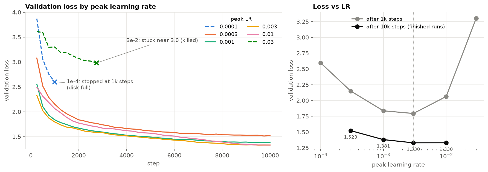
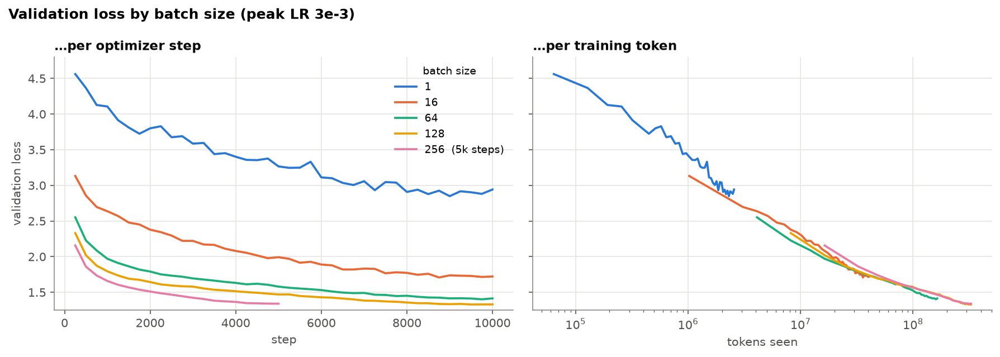
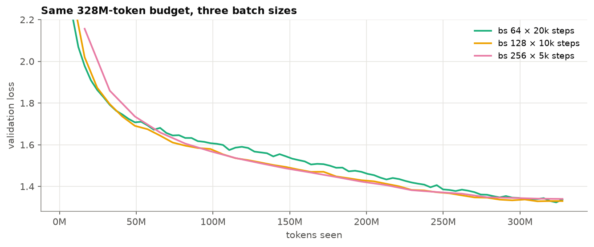
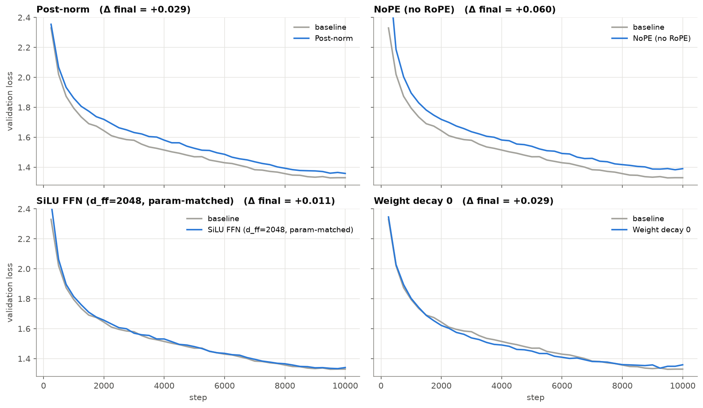
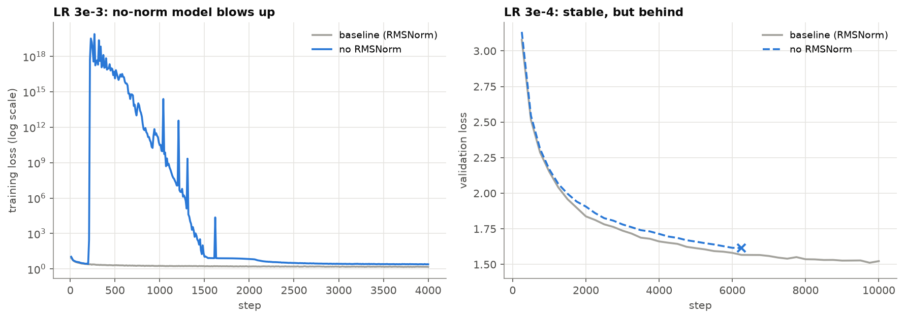

# CS336 Assignment 1: Basics

My implementation of a BPE tokenizer and Transformer language model from scratch. I wrote all the code by hand as is required in the original assignment. The structure/plots in this README were generated by Claude, and the text is >95% written by me.

The model is trained on TinyStories using RTX 4090s that I rented online (24-48GB RAM). Following the assignment, I tested some generations, did learning rate / batch size tuning, and ran some ablations. The assignment handout is [cs336_assignment1_basics.pdf](./cs336_assignment1_basics.pdf).

## Installation

Per original repo, datasets must be installed via `wget`:

```
mkdir -p data
cd data

wget https://huggingface.co/datasets/roneneldan/TinyStories/resolve/main/TinyStoriesV2-GPT4-train.txt
wget https://huggingface.co/datasets/roneneldan/TinyStories/resolve/main/TinyStoriesV2-GPT4-valid.txt

wget https://huggingface.co/datasets/stanford-cs336/owt-sample/resolve/main/owt_train.txt.gz
gunzip owt_train.txt.gz
wget https://huggingface.co/datasets/stanford-cs336/owt-sample/resolve/main/owt_valid.txt.gz
gunzip owt_valid.txt.gz

cd ..
```

## Implementation

| Component | File |
|---|---|
| BPE training and tokenizer (encode / decode) | [`cs336_basics/tokenizer.py`](./cs336_basics/tokenizer.py) |
| Alternative BPE training implementation | [`cs336_basics/tokenizer_v2.py`](./cs336_basics/tokenizer_v2.py) |
| Tokenizer CLI (train, encode dataset) | [`cs336_basics/run_tokenizer.py`](./cs336_basics/run_tokenizer.py) |
| Model layers (Linear, Embedding, RMSNorm, SwiGLU, RoPE, attention) | [`cs336_basics/modules.py`](./cs336_basics/modules.py) |
| Transformer LM | [`cs336_basics/transformer.py`](./cs336_basics/transformer.py) |
| AdamW, cosine LR schedule, gradient clipping, cross-entropy | [`cs336_basics/optimizer.py`](./cs336_basics/optimizer.py) |
| Data loading and checkpointing | [`cs336_basics/train_utils.py`](./cs336_basics/train_utils.py) |
| Training loop | [`cs336_basics/train_model.py`](./cs336_basics/train_model.py) |
| Decoding | [`cs336_basics/decoding.py`](./cs336_basics/decoding.py) |

### Tokenizer

I implemented two BPE tokenizer algorithms: the naive one (v1) where we recompute token pair counts after each merge, and an optimized version (v2) where we only compute the marginal changes in token pair counts (which is surprisingly subtle). Both also include parallelized pretokenization following the course-provided code.

Benchmarking on TinyStories training data (AWS g6.xlarge, CPU = AMD EPYC 7R13):

| Algorithm | Time elapsed | (pretokenize) | (count section) | (merge section) |
|---|---|---|---|---|
| v1 (naive) | 29m 13s | 2m 47s | 18m 2s | 8m 17s |
| v2 (marginal) | 14m 29s | 2m 48s | 8m 16s | 3m 25s |

TODO: Check compression rate on valid set. Would be interesting to see graph of vocab size vs compression rate.

### Model

| Parameter | Value |
|---|---|
| Layers | 4 |
| d_model | 512 |
| Heads | 16 |
| d_ff | 1344 (SwiGLU) |
| Context length | 256 |
| Vocab size | 10,000 |
| Positional encoding | RoPE (θ = 10,000) |
| Normalization | Pre-norm RMSNorm |

There is also a larger model spec for OpenWebText, but to save GPU-hours I skipped that part of the assignment.

### Training setup

- Default learning rate: 3e-3
- Default batch size: 128
- AdamW: β = (0.9, 0.95), weight decay 0.1
- Gradient clipping: 1.0

We run a simple training loop with AdamW optimizer, gradient clipping, and a cosine learning rate scheduler.

## Experiments

All plots are produced by [`notebooks/training_analysis.ipynb`](./notebooks/training_analysis.ipynb), which pulls run data from wandb.

### Learning-rate sweep



I swept learning rate from 1e-4 to 3e-2, and Claude generated these very helpful visuals. I concluded that 3e-3 is the best learning rate for this particular setup (and use it throughout the rest of the pset).

### Batch-size sweep





Very small batch sizes, like 1 and 16, are much noisier than the larger batch sizes. However, it seems like the overall effect on loss curves is small, and final val loss is comparable for 64, 128, and 256.

On the other hand, batch sizes do have a large effect on GPU metrics (medians over each run):

| Batch size | Throughput (tokens/s) | GPU util | Power draw | GPU memory used |
|---|---|---|---|---|
| 1 | 7k | 20% | 95 W | 1.0 GB |
| 16 | 78k | 91% | 328 W | 3.7 GB |
| 64 | 99k | 98% | 386 W | 12.4 GB |
| 128* | 87k | 100% | 336 W | 22.8 GB |
| 256 | 100k | 100% | 374 W | 42.5 GB |

\*Run on a different machine from the others.

### Architecture ablations



1. Post-norm (taking RMSNorm after attention/FFN) and NoPE make sense.
2. It seems like replacing SwiGLU with SiLU has no discernible effect in this regime -- this kind of makes sense since we kept #params the same.
3. Weight decay also has the expected effect -- better at first (since unconstrained) but worse near the end (since too unregularized).



Removing RMSNorm caused loss blowups, which makes sense since upstream changes in distribution take time for downstream layers to adjust to, especially if they are large. Lowering LR resulted in no loss blowups.

### Summary

The best validation loss was **1.33**, achieved using LR = 3e-3 and batch size 128.

## Sample generation

Example rollouts (using lowest val loss checkpoint):
```
Prompt: Once
[encode] DONE  elapsed=0.0s  bytes=0.00MB (0.00MB/s)  tokens=1
[encode] DONE  elapsed=0.0s  bytes=0.00MB (0.40MB/s)  tokens=1
Completion: Once upon a time, there was a sleepy teddy bear named Bobo. Bobo loved to play in the forest. One day, he saw a big pine tree with his favorite friend, a little bird named Chirpy.
"Chirpy, come play with me in the pine tree!" said Bobo. Chirpy was so sleepy, he didn't want to come out. He said, "Please, Bobo, can I come out? I am very sleepy."
Bobo thought for a moment and decided to help Chirpy out of the pine tree. They both went to the pine tree and started to play hide and seek. Chirpy hid behind the pine tree, and Bobo knew he had to find her.
"Ready or not, here I come!" Chirpy laughed and flew away to find a hiding spot. When Bobo came back, Chirpy counted to ten and then started to look for him. She flew high and low, and finally found him in a little pile of leaves.
"Found you!" Chirpy shouted, laughing as she jumped onto the leaves. "You are the best friend ever!"
From that day on, Bobo and Chirpy were the best of friends. They played together in the forest every day, and Lulu always brought a handful of colorful, colorful leaves for her friend.
```

```
Prompt: Once
[encode] DONE  elapsed=0.0s  bytes=0.00MB (0.00MB/s)  tokens=1
[encode] DONE  elapsed=0.0s  bytes=0.00MB (0.31MB/s)  tokens=1
Completion: Once upon a time, there was a little boy named Tim. He had a lot of blocks. Tim liked to play with his blocks every day. One day, he decided to decorate his room. He put up colorful and colorful stickers on his walls.
In the middle of the room, Tim found a big box. He opened the box and saw that all his toys were mixed up. Tim knew he had to sort them up. He picked up the blocks and put them all over the walls. In oneite, he started to put them away when he was done.
Tim forgot about his room and his blocks to be organized. When he was done, the room looked messy again. His room was so messy that he couldn't see the missing blocks. Tim was sad and knew he needed to clean the room. He looked for the missing blocks again, but it was gone. On the day of his playtime, everything was ruined.
```

Overall coherent, but some semantic mistakes here and there.

## Reproducing

```sh
# Unit tests
uv run pytest

# Train tokenizer
uv run python -m cs336_basics.run_tokenizer --mode train --dataset-name TinyStories --in-path data/TinyStoriesV2-GPT4-train.txt

# Encode datasets
uv run python -m cs336_basics.run_tokenizer --mode tokenize --dataset-name TinyStories --in-path data/TinyStoriesV2-GPT4-train.txt --out-path data/TinyStories_encoded_train.bin
uv run python -m cs336_basics.run_tokenizer --mode tokenize --dataset-name TinyStories --in-path data/TinyStoriesV2-GPT4-valid.txt --out-path data/TinyStories_encoded_valid.bin

# Train model
uv run python -m cs336_basics.train_model --train-data data/TinyStories_encoded_train.bin --val-data data/TinyStories_encoded_valid.bin

# Generations
uv run python -m cs336_basics.decoding --model-path checkpoints/<checkpoint-name> --prompt "Once"

# Plots
uv run --with jupyter --with matplotlib --with pandas jupyter lab notebooks/training_analysis.ipynb
```
